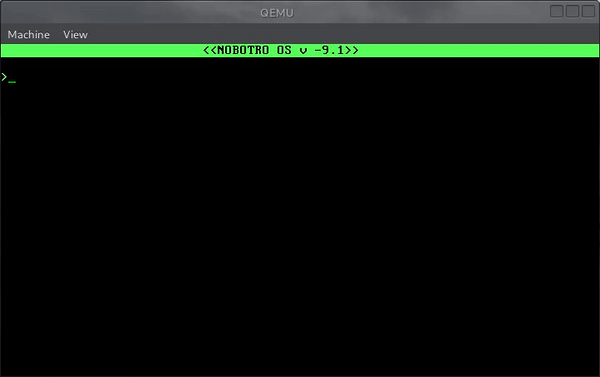

simple operating system with bootloader and mini kernel.
bootloader written in asm and mini kernel in c.  
it has protected mode ,gdt,simple video and keyboard driver,standart c librarys.  
good for study purposes  
 
make all -to compile  
make emu-to emulate in qemu  
make flash-to write os in flash drive and check in real pc(!!!warning. use formated and empty usb drive.  
check usb drive path in make file before flash to avoid data los.in my case usb drive is in /dev/sdb )  

yotutube video:
https://www.youtube.com/watch?v=fimpOBOuWmg

